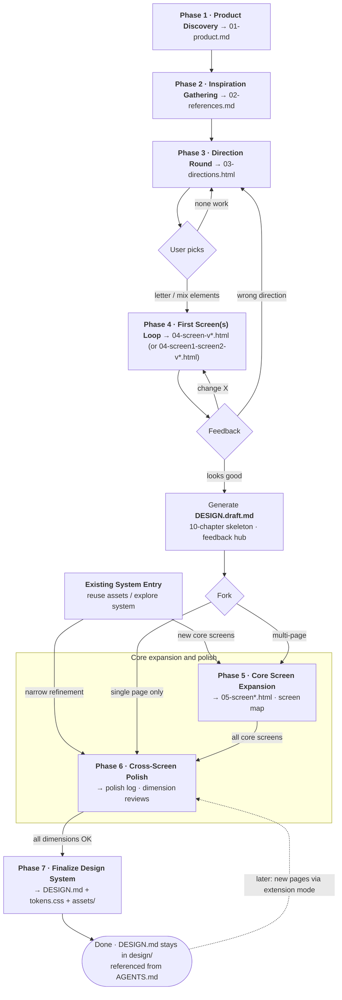

# zero-to-design

**English** · [简体中文](README.zh-CN.md)

An interactive agent skill that works both from zero and inside an existing system. It can reuse an existing design system, or explore the application to extract an observed baseline before designing additional pages and components.

👉 **Live examples:** [Pulse](https://mitaraifail.github.io/zero-to-design/en/)



## What it does

`zero-to-design` is a conversational design workflow for AI coding agents, built for backend engineers and non-designers. It supports both new products and incremental work inside existing applications. In existing-system mode, it first identifies and validates the current `DESIGN.md`, tokens, components, routes, and engineering constraints; when those assets are missing, it explores the codebase and running UI to create an observed baseline. New core screens enter Phase 5, while narrow refinements can enter Phase 6 directly.

| Phase | Name | Output |
|-------|------|--------|
| 1 | Product Discovery | `01-product.md` — 8 key questions pin down what you're building and how it should feel |
| 2 | Inspiration Gathering | `02-references.md` — reference sites, screenshots, likes/dislikes, explicit preferences |
| 3 | Direction Round | `03-directions.html` — 3-4 genuinely different design directions, each with palette, typography, layout, and a live signature move |
| 4 | Screen Preview Loop | `04-<screen>-v*.html` (or `04-<screen1>-<screen2>-v*.html`) + `DESIGN.draft.md` — iterate the first 1–2 key screens until you say "looks good" |
| 5 | Core Screen Expansion | `05-<screen>.html` + `05-screen-map.md` + `component-inventory.md` — the smallest core screen set, with real states and contracts |
| 6 | Cross-Screen Polish | `06-polish-log.md` + optional dimension review pages — typography, spacing, color, components, responsive behavior, accessibility, and motion |
| 7 | Design System | `DESIGN.md` + `tokens.css` + `assets/` — the final, reusable design system, referenced from AGENTS.md |

## Why I built this

I recently had to build a new website from scratch. The hardest part turned out not to be the code — it was making the AI-generated interface look good *and* stay consistent.

That experience sent me down a three-step learning path, which eventually became `zero-to-design`.

**Step 1: "AI taste" is just the absence of direction.**  
When you ask a model to "make a modern landing page" without specifics, it returns the statistical average of its training data: purple gradients, Inter font, 3-column feature cards, fade-up animations. Existing "remove AI slop" skills can over-correct and strip away things you actually like. The real fix is to give the model both positive design guidance *and* explicit red-line rules.

**Step 2: The container for those rules is `DESIGN.md`.**  
Without a single source of truth, every page an agent writes drifts: different buttons, different spacing, different interaction patterns. `DESIGN.md` is becoming the de-facto standard for AI-readable design systems — colors, typography, components, UX constraints, and Do/Don't rules in one file, referenced from `AGENTS.md`.

**Step 3: The hard part is creating the first aesthetic `DESIGN.md` from zero.**  
Knowing where the spec should live is easy. Knowing what to put in it — especially when you are not a designer — is hard. `zero-to-design` is the guided conversation that walks you through that gap: product definition, reference gathering, direction selection, first-screen(s) iteration, core screen expansion, cross-screen polish, and finalization.

In short: **removing AI slop is the starting point, `DESIGN.md` is the container, and `zero-to-design` closes the last mile of building that container from nothing.**

## Features

- **Conversational guidance** — every step explains the "why" and offers concrete options; free-form answers are always accepted, never force-mapped onto presets
- **Dynamic discovery of design-constraint skills** — scans your environment for skills like [`impeccable`](https://github.com/pbakaus/impeccable) and `frontend-design`, verifies they load, and lets you pick the constraint set used for direction generation and beyond; `impeccable` sub-skills are preferred
- **Existing-system intake** — reuse existing design assets when available, or extract an observed baseline from the codebase and running UI; new core screens enter Phase 5, while narrow refinements enter Phase 6
- **Multiple candidates** — Phase 5 can compare core screen structures and Phase 6 can compare dimension-specific polish options within the active `DESIGN.md` constraints
- **A living DESIGN.md** — decisions accumulate into `DESIGN.draft.md` from Phase 4 onward and evolve with your feedback, then get finalized in Phase 7; after completion, an extension mode lets you design new pages against the existing system
- **Automatic language matching** — the skill detects your language and runs the entire experience in it (conversation, questions, and every generated artifact); only file names, token names, and code identifiers stay in English

## Install

### Via skills CLI (recommended)

```bash
npx skills add mitaraifail/zero-to-design
```

> Add `-g` to install globally so it's available across all projects.

### Update

To update an existing installation, run the same command again from the project where it was installed:

```bash
npx skills add mitaraifail/zero-to-design
```

If it was installed globally, keep the `-g` flag:

```bash
npx skills add mitaraifail/zero-to-design -g
```

Restart your agent session after updating so it reloads the latest `SKILL.md`. Reinstalling may overwrite local edits to the skill, so back them up first if needed.

### Manual

Clone the repo and copy it into your agent's skills directory:

```bash
git clone https://github.com/mitaraifail/zero-to-design.git

# Claude Code
cp -r zero-to-design ~/.claude/skills/

# Kimi Code CLI
cp -r zero-to-design ~/.agents/skills/
```

### Uninstall

```bash
npx skills remove zero-to-design
```

For a globally installed skill, add `-g`:

```bash
npx skills remove -g zero-to-design
```

## Usage

Just describe what you want to design — in any language:

- "I want to design a landing page from scratch"
- "Help me build a design system for my SaaS dashboard"
- "Design an account page inside my existing Nuxt app"
- "Explore this app's current UI, then design an order-detail page"
- "从 0 设计一个首页"
- "帮我走一遍品牌设计流程"

The skill checks for an existing `design/state.md` first, so interrupted sessions resume where they left off.

## Uses the skills you already have

`zero-to-design` has no hard dependencies. Instead of requiring you to install anything, at Phase 3 it **scans your environment for design-related skills you already installed** (e.g. [`impeccable`](https://github.com/pbakaus/impeccable) sub-skills like `bolder` / `typeset` / `layout`, or [`frontend-design`](https://github.com/anthropics/skills) as a fallback), verifies which ones actually load, presents the list, and **lets you decide which to use** for the rest of the workflow. The recommended primary constraint layer is `impeccable`; `frontend-design` is a solid fallback when `impeccable` is unavailable.

If no design skill is found, the workflow continues with built-in fallback rules (font/color/layout/copy bans) and tells you which constraint source is in use.

## License

[MIT](LICENSE)
